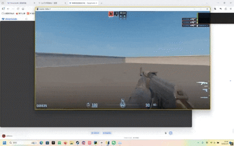

# -YOLOv11-CS-
大概原理是使用DXGI抓屏→YOLOv11模型训练+TensorRT-YOLO模型加速→输出结果，根据结果使用win32gui进行鼠标移动定位（简单PID控制算法）来完成一整套流程，目前基础功能已经完成，还有多人识别以及移动灵活度的问题需要解决。
开源出来仅供学习🤓👆

# 一：关于高帧抓屏 （DXGI）
如果只看抓屏这个功能的话网上推荐是有很多的，就比如pyautogui和pywin32库，但是为了追求推理速度需要追求更快速的抓屏效果，前面说的库一般是通过将GPU中的图像搬到CPU然后再进行处理，比较麻烦。DXGI抓屏就方便很多，整个抓屏的过程都在GPU上运行，这样使得整个过程CPU占用低的同时效率更高。🐂

那么问题来了：目前现有的DXGI抓屏案例大多都是以C++为基础进行的，基本上没有DXGI直接调用的案例（也不能说那么绝，DXcam的库实现原理应该是一样的，不过实际用起来并没有那么舒服，并且帧率表现并没有特别突出）。那么这个时候如果要使用DXGI进行抓屏的话就一个方案了：将C++编译好的代码打包成DLL，然后使用python调用出来直接调用相关功能，相当于核心还是c++，而python只是进行使用，这样就能够在python上使用DXGI抓屏了👍

（实机操作下来，窗口模式下有80fps左右足够进行后续推演。看到网上其他演示能达到120-150fps，应该是python的运行效率问题或者其他问题，有待考究，后续研究一下是哪方面的问题）🤓👆

这里使用的是某个作者留下的DXGI打包的DLL，也感谢大佬开源让我省下很多精力时间😶‍🌫️😶‍🌫️😶‍🌫️：https://github.com/JuZi233/dxgi_shot

# 二：关于模型训练（YOLOV11）
YOLO的模型训练相当傻瓜式，同时准确率也非常高，使用首选👍

不过有几个注意点：

①收集数据集的时候，在截取目标的同时更多的也要同时把干扰物体也拍进去，以此来解决识别框乱飘的情况

②数据集一定要多，统计量越多，得到的结果也就越准确（不过尽量不要在同一个位置刷非常多的照片，这样的意义不大并且比较耗费精力）

③输出的两个文件best.pt和last.pt通常来说是best.pt样本表现的会更好一些，而last.pt用来下一轮训练。但建议最好两个都测试一下，有的时候会有last的样本表现比best更好的情况，反正也不会花很多时间，不如多试试多看看。

④在数据集多的情况拉高训练批次是正确的选择，但是记得设置一个早停的参数，防止训练过程中发生过拟合（训练了n批后精度还是没有任何变化），如果出现这样的情况那训练时间再长也是浪费时间。😔

⑤训练集和测试集4：1刚好🤓👌

# 三：关于模型加速（Tensorrt-YOLO）①
如果当拉出来DXGI抓屏和YOLOv11的模型会发现速度非常快，帧率非常高。但是！把这俩加一起就会发现帧率能掉到10帧以下，非常夸张。😕为什么捏😕 虽然YOLO看起来推演速度很快，但是游戏是按帧来算的，这么一比yolo的推理速度就变得慢了。因为yolo得将图片推理完才会将图像显示出来，所以这就导致图像输出速度严重拖慢了🤨

那么要如何加速捏🤨 诶对喽！ 英伟达的Tensorrt加速！ 😇

然后仔细翻看了官方文档发现根本看不懂叽里咕噜的😥😥😥😥

不过幸好国内有大佬将这部分整合并且做了一套新架构，这样一来就可以相对比较容易地使用TensorRT加速了（甚至还对YOLO进行了优化，太厉害了😎😎😎）这里感谢原作者，

留个链接https://github.com/laugh12321/TensorRT-YOLO?tab=readme-ov-file  如果对你们有帮助的话可以去爱发电支持一下大佬😶‍🌫️😶‍🌫️😶‍🌫️

那么这里就列举一些注意事项，虽然Tensorrt-YOLO相比官方的操作简单的多的多的多，但是新人刚上手操作还是会碰到一些问题的，可以顺便看看：

①着重注意检查“环境变量”！大多时候会自动加入，但是偶尔程序会出bug或者设置方面出了问题等情况导致环境变量没有加进去。如果操作过程中出现报错那么请第一时间排查一下环境有没有配置好

②CUDA的版本和Tensorrt的版本不 要 太 新（划重点🤓），着重注意这两个版本是否兼容。（适用于任何软件，安装比新版本旧两代的一般都是最好的选择，因为旧版本更加稳定🤓👆）

③修改完环境变量后记得重启命令行，否则修改的环境变量不会生效

④建议优先使用Anaconda的cmd进行操作，也就是yolo配套的Anaconda，环境更完善更不容易报错

⑤如果有多个python版本，请记得确认当前使用的python版本是否为你环境安装好的那个，这非常重要😕😕😕

# 四：关于模型加速（Tensorrt-YOLO）②

关于训练过程中静态batch和动态batch的区别：

静态batch：根据固定的batch size进行推理，因为固定所以进行极致优化，性能更强

动态batch： 指定batch size的范围，是引擎能够灵活适配这段范围，灵活性更好

（ps：batch size指一次推理中同时处理的样本数量，像游戏那种一次处理一帧那就可以使用静态batch）、

# 五：关于鼠标控制
有些游戏是会禁用常用库的鼠标移动的（就比如瓦洛兰特），所以使用cs2来举例（使用win32库😇😇）

由于在游戏中鼠标位置一般被定死了，绝对移动会失效，所以这里使用的是相对移动的方式：推理得到坐标，与准星坐标计算得到差值，然后将这个插值进行pid解算进行移动（由于相对移动是一帧的瞬间移动一段距离，所以可以直接将这一数值当作速度，那就可以套用位置PID的计算方式，根据距离大小来调控鼠标移动过去的速度）

位置PID的公式：u(t)=Kp​e(t)+Ki​∫0t​e(τ)dτ+Kd​dtde(t)​

    u(t) —— 控制器输出（控制量，绝对位置）

    e(t)=r(t)−y(t)e(t)=r(t)−y(t) —— 误差（设定值减测量值）

    KpKp​ —— 比例增益 （越大越灵敏，注意震荡）

    KiKi​ —— 积分增益 （消除小误差，辅助Kp）

    KdKd​ —— 微分增益  （消除震荡，过大会反而导致迟钝）

# END

暂时就先这样，v1.0版会发出目前的py文件和模型（暂时还不太会将py文件打包，因为trt-yolo是第三方库这是最麻烦的，加上最近太忙太忙了，也许理论上把里面的库都安装了也能跑？你们可以试试看哈哈哈哈哈哈🤓），需要的可以拿回去研究😶‍🌫️😶‍🌫️😶‍🌫️这是我发的第一个开源项目，谢谢捏😶‍🌫️😶‍🌫️😶‍🌫️

